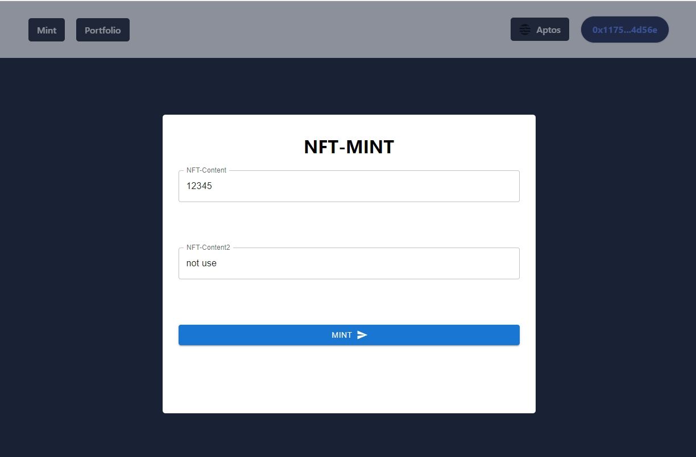
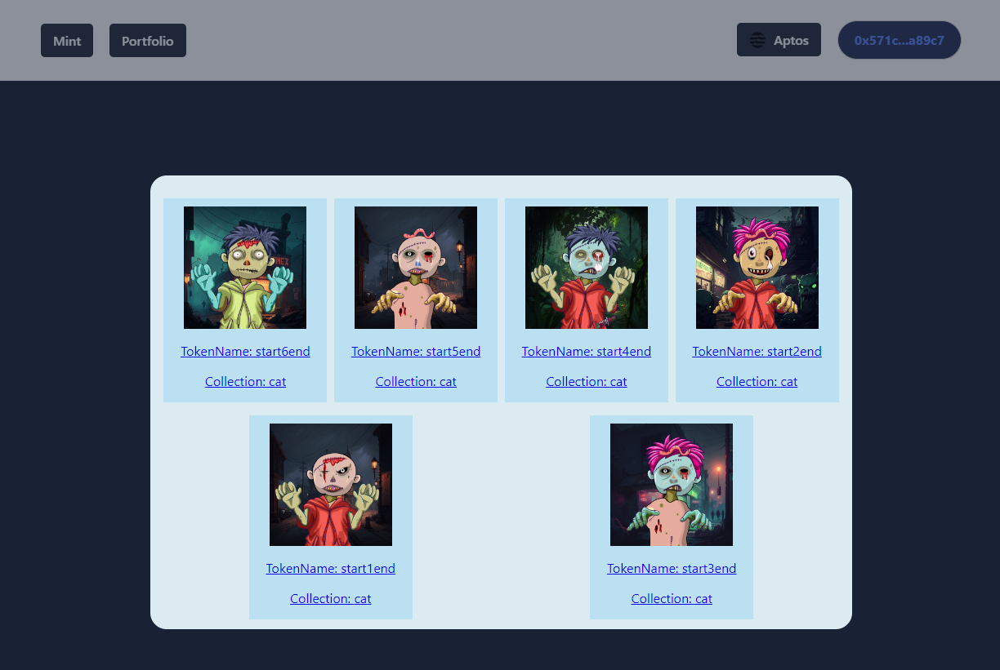

# 简介

* <u>Mint界面：</u>合约已经构造出一个nft的集合，只需要设置content就可以**mint**
* <u>查询界面：</u>是查询账户**所有的NFT[包括本合约创建以外的]**
  * 因为多次查询时间过长，所以在view合约中使用indexer+vector一次查询当前账户下token的所有信息用于展示

# 效果

* Mint界面

* 账户NFT展示

