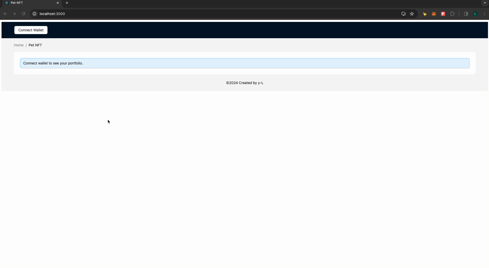

# Getting Started with Create React App

### `npm start`

Runs the app in the development mode.\
Open [http://localhost:3000](http://localhost:3000) to view it in the browser.

## Dapp Demo

因为时间原因，暂时只实现了钱包连接和 PET NFT 链上数据的宠物名字展示.

但相关其他 API 调用接口代码调用差不多已经写好。

 

