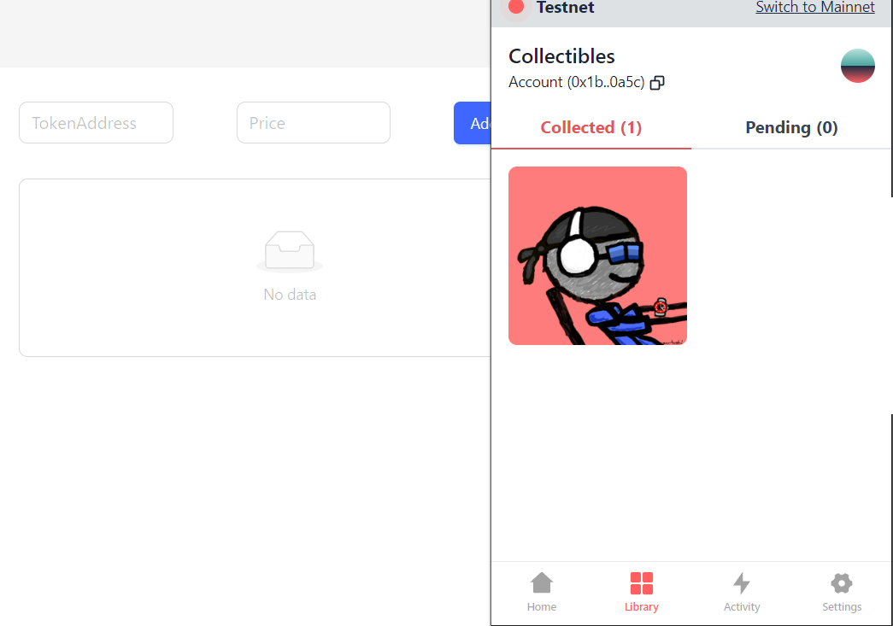

# **NFT Market System**
The NFT Market System is a decentralized application built on the Aptos blockchain. It provides the ability to create, purchase, and cancel orders. To use this system, users need to connect to their own wallet. This readme file provides detailed guidance on how to use and navigate the system.

## **Features**

- **Create Order**: Users can create new orders, specifying the NFTs and prices to be sold.

- **Purchase orders**: Users can browse and purchase orders from other users.

- **Cancel Order**: Users can cancel their orders at any time.

- **View NFT**: Users can jump to the blockchain browser to view detailed information about this NFT by clicking on the Token address in the order.
## Getting Started

- Please use the `npm start` command in the **client** folder to run

1.**User Interface**
  
  

2.**User Wallet Connection**

- Click the "Connect Wallet" button in the upper right corner, select the wallet you want to use, and then follow the prompts to connect.

3.**Create an order**

- To ensure a smooth presentation, you may need to mint two NFTs into your wallet at the contract of this DApp.The String parameter is a content information of NFT, which you can freely fill in.
  
- https://explorer.aptoslabs.com/account/0x8b256cbe708582fd2deeb0638e286311242b9f8fc386bce8799a24aa9082a271/modules/run/nftmarket/mint?network=testnet

- Enter the address and price of the NFT you want to sell in the input box, and then click the "Add" button. Your NFT will be hosted to a resource account for sale, but you can cancel the order at any time to retrieve your NFT, so there is no need to worry.

Next, let's add two NFT orders.

- We have now created two orders. Click the Buy button to purchase NFTs using the APT on your account. If the current address is the creator of the order, you can click the Remove button to cancel the order. (If you are as lucky as me and encounter a situation where the Token address in the order does not appear, please reconnect your wallet.)

4.**Browsing and purchasing orders**

- Let's switch to another wallet address and click the Buy button to purchase the first order. The transaction confirmation interface for the wallet has appeared, let's click the "Approve" button.

- We can see in the wallet that we have already paid 1APT to purchase this NFT.

5.**Cancel order**

- When we try to cancel an order using the second wallet address, an error occurs because only the creator of the order can cancel it.

- Let's switch back to the first wallet address and click the Remove button to cancel the order.

- The order has been cancelled and the order list is empty. You have retrieved your NFT.
