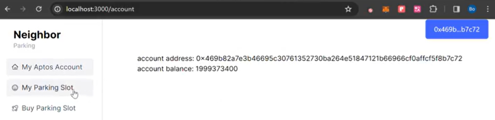
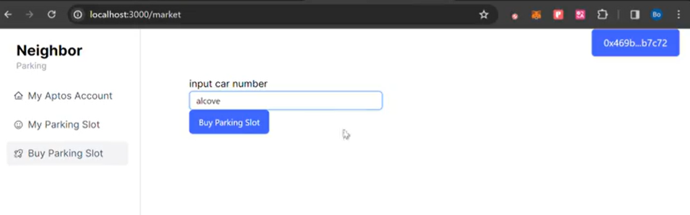
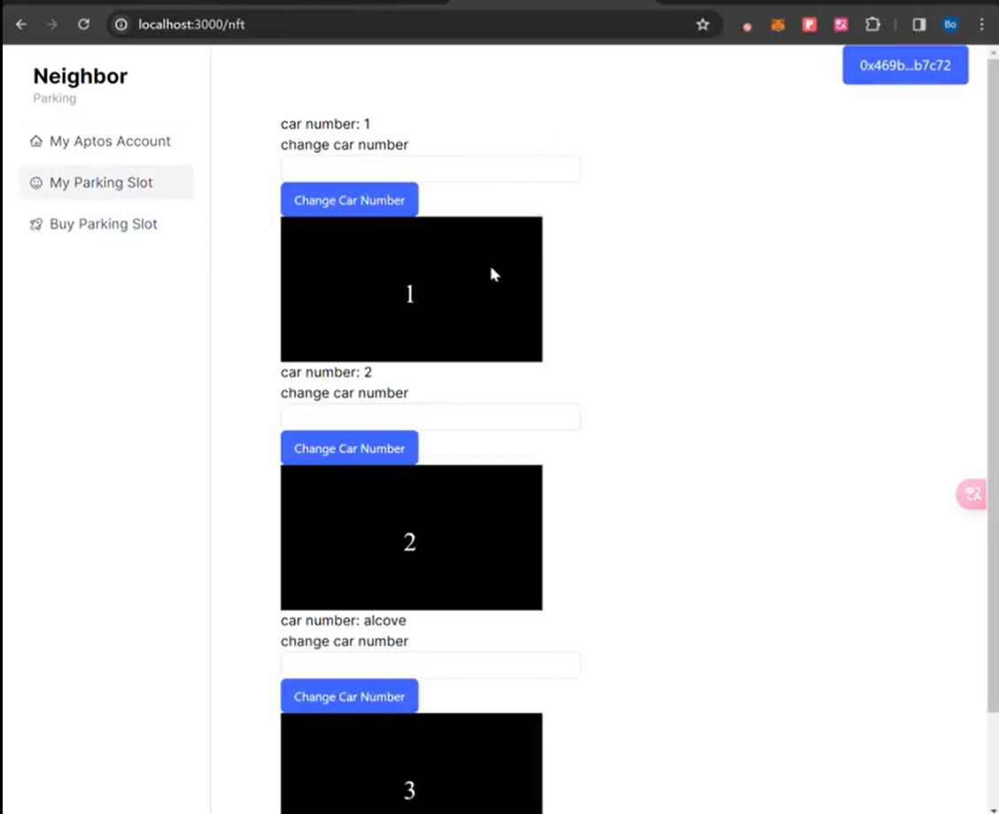
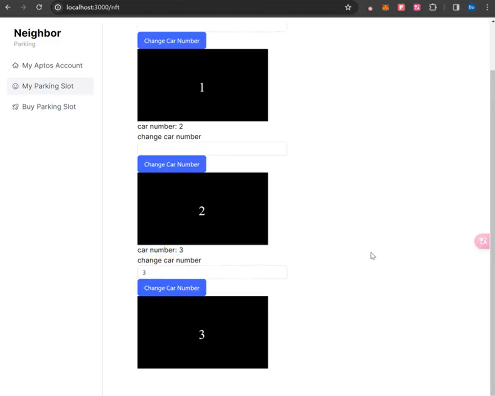

neighborhood parking lot smart contract.

Assuming your residential community has privately owned parking spaces. Each parking space is represented by a NFTthat uniquely identifies its location. 
This dapp demo implements the following functionalities:
* get current account information

* mint an nft as a parking slot

* check my parking slot

* change car number nft property

technique:
* aptos move
* nextjs14

video demo:
https://twitter.com/twiagle/status/1771369429932343613